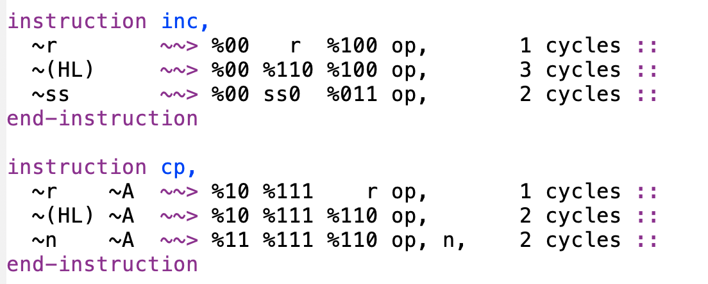

title: "GBForth"
controls: false
progress: true
theme: tkers/cleaver-theme-sunset

---

# GBForth
## Friday Talks November


---

# Game Boy hardware
- 8-bit CPU
- 4 MHz (~1M instructions)
- 32kB ROM (of which 16 bankable)
- 4kB RAM
- Cartridge contains data + hardware


---


---

# Forth

- Stack based
- Concatenative

```fs
: INC
  1 + ;
```

```
1   =>  PUSH 1
+   =>  CALL +
```

---

# Approaches we considered
- Read docs about GB
- Start writing a compiler
- ...wait forever until you get something on the screen

---

# ...downsides
- Not incremental
- Long feedback cycle

---

# Our approach
1. Start with working game (binary)
2. Make Forth emit those bytes
3. Reverse engineer + refactor bytes
  - Add abstractions
  - Build libraries
4. Forth compiler -> GB binary

---


---

## Reverse-engineer binary to assembly

```
$00  $c3  $50  $01  $ce  $ed  $66  $66
$cc  $0d  $00  $0b  $03  $73  $00  $83
$00  $0c  $00  $0d  $00  $08  $11  $1f
$88  $89  $00  $0e  $dc  $cc  $6e  $e6
$dd  $dd  $d9  $99  $bb  $bb  $67  $63
$6e  $0e  $ec  $cc  $dd  $dc  $99  $9f
$bb  $b9  $33  $3e  $45  $58  $41  $4d
$50  $4c  $45  $00  $00  $00  $00  $00
$00  $00  $00  $00  $00  $00  $00  $00
$00  $00  $01  $33
```

---

## Make program that emits bytes

<pre style='font-family: "Monaco", monospace'>
$00 c, $c3 c, $50 c, $01 c, $ce c, $ed c, $66 c, $66 c,
$cc c, $0d c, $00 c, $0b c, $03 c, $73 c, $00 c, $83 c,
$00 c, $0c c, $00 c, $0d c, $00 c, $08 c, $11 c, $1f c,
$88 c, $89 c, $00 c, $0e c, $dc c, $cc c, $6e c, $e6 c,
$dd c, $dd c, $d9 c, $99 c, $bb c, $bb c, $67 c, $63 c,
$6e c, $0e c, $ec c, $cc c, $dd c, $dc c, $99 c, $9f c,
$bb c, $b9 c, $33 c, $3e c, $45 c, $58 c, $41 c, $4d c,
$50 c, $4c c, $45 c, $00 c, $00 c, $00 c, $00 c, $00 c,
$00 c, $00 c, $00 c, $00 c, $00 c, $00 c, $00 c, $00 c,
$00 c, $00 c, $01 c, $33 c,
</pre>

---

## Find the patterns and meaning

<pre style='font-family: "Monaco", monospace'>
$00 c, $c3 c, $50 c, $01 c, <span style="color: #AA00AA">$ce c, $ed c, $66 c, $66 c,
$cc c, $0d c, $00 c, $0b c, $03 c, $73 c, $00 c, $83 c,
$00 c, $0c c, $00 c, $0d c, $00 c, $08 c, $11 c, $1f c,
$88 c, $89 c, $00 c, $0e c, $dc c, $cc c, $6e c, $e6 c,
$dd c, $dd c, $d9 c, $99 c, $bb c, $bb c, $67 c, $63 c,
$6e c, $0e c, $ec c, $cc c, $dd c, $dc c, $99 c, $9f c,
$bb c, $b9 c, $33 c, $3e c,</span> <span style="color: #00AA00">$45 c, $58 c, $41 c, $4d c,
$50 c, $4c c, $45 c, $00 c, $00 c, $00 c, $00 c, $00 c,
$00 c, $00 c, $00 c, $00 c, $00 c, $00 c, $00 c, $00 c,</span>
$00 c, $00 c, $01 c, $33 c,
</pre>

---

## Extract patterns into definitions

<pre style='font-family: "Monaco", monospace'>
<span style="color: #AA00AA">: logo
  $ce c, $ed c, $66 c, $66 c, $cc c, $0d c, $00 c, $0b c,
  $03 c, $73 c, $00 c, $83 c, $00 c, $0c c, $00 c, $0d c,
  $00 c, $08 c, $11 c, $1f c, $88 c, $89 c, $00 c, $0e c,
  $dc c, $cc c, $6e c, $e6 c, $dd c, $dd c, $d9 c, $99 c,
  $bb c, $bb c, $67 c, $63 c, $6e c, $0e c, $ec c, $cc c,
  $dd c, $dc c, $99 c, $9f c, $bb c, $b9 c, $33 c, $3e c, ;</span>

<span style="color: #00AA00">: title
  $45 c, $58 c, $41 c, $4d c, $50 c, $4c c, $45 c, $00 c,
  $00 c, $00 c, $00 c, $00 c, $00 c, $00 c, $00 c, $00 c, ;</span>

$00 c, $c3 c, $50 c, $01 c,
<span style="color: #AA00AA">logo</span>
<span style="color: #00AA00">title</span>
$00 c, $00 c, $01 c, $33 c,

</pre>

---



---

## Full Forth Assembler "game"

<pre style='font-family: "Monaco", monospace'>
<span style="color: #00AA00">title: EXAMPLE</span>

$150 ==>
main:

di,
$ffff # sp ld,

%11100100 # a ld,

a [rGBP] ld,

0 # a ld,
a [rSCX] ld,
a [rSCY] ld,

<span style="color: #777777">( ... )</span>
</pre>

---


---

# Now what?
## Implementing Forth

- Break binary compatibility
- New testing strategy
  - Unit tests
  - Visual comparison

---

# Implementing Forth
- Add a compiler
- Implement code primitives
- Using emulator for automated testing
- Adding libraries

---


---


---


--
